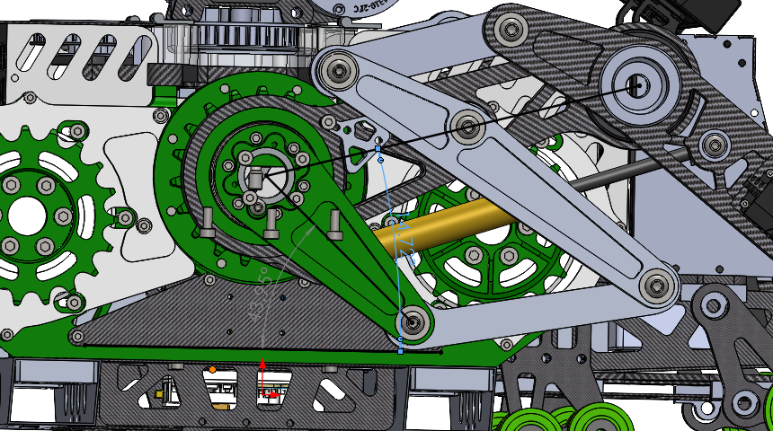

# 【RM2026 复旦大学 星云EGA战队】平衡步兵强化学习控制部署开源

仓库链接：https://github.com/chushanxiaodaoshi/XYEGA_RM2026_WheelLeg_Infatry_RLdeploy.git

## 仓库简介

由于我们实际上场的源码耦合度高（史山堆积），而且对战队的电控代码框架依赖度很高，所以就把源码中，部署相关的重要部分给拆分了出来，以伪代码为主展示思路，并展示最终的总控制流程；其中运动学解算、调用cubeai进行板载推理等部分做了重点保留，以供参考；翻倒自救、功率控制部分与部署相关性弱，没有展开，仅展现思路。`source_code/` 中还保留了与部署直接相关的实车源码快照，但它不是可独立编译的完整工程。仓库保留26国赛上场版本的 ONNX 模型，但 CubeAI 自动生成代码和 CubeAI Runtime 不随仓库发布，使用者需要根据自己的 STM32Cube.AI 版本自行生成和配置。注意该仓库采取弧度制。

该仓库中运动学解算的相关内容其实就是杨佬在sim2sim里面验证通过后迁移下来的，

这一块有疑问可以直接参考杨佬的sim2sim仓库：https://github.com/yly-true/fudan_rl_wheel_leg.git

硬件：4个髋关节电机为8009P，两个轮电机为3508，搭载减速比16.33的耐造减速箱；

用的港科开源的超电，详见：https://bbs.robomaster.com/article/761385?source=4

髋关节接了固态继电器，超级电容+大容值电解电容，防止剧烈运动的时候髋电机进欠压保护。

## 架构概述

```
传感器原始数据
    │
    ▼
┌─────────────────┐
│  电机偏置转换    │  实机零点 → 策略零点
└────────┬────────┘
         ▼
┌─────────────────┐
│  虚拟腿运动学    │  五连杆解算 → phi3/l0/雅可比
└────────┬────────┘
         ▼
┌─────────────────┐
│  构建 RL 观测    │  25维: gyro+重力+指令+关节偏差+速度+上步动作
└────────┬────────┘
         ▼
┌─────────────────┐
│  观测历史堆叠    │  125维 = 5帧 × 25维，循环左移：[t-4, t-3, t-2 , t-1, t]的历史五帧结构
└────────┬────────┘
         ▼
┌─────────────────┐
│  CubeAI 推理     │  双输入(obs+obs_history) → 调用对应的api即可 → 6维动作
└────────┬────────┘
         ▼
┌─────────────────┐
│  PD + 雅可比映射 │  虚拟力矩 → 实际关节力矩 + 气弹簧补偿
└────────┬────────┘
         ▼
┌─────────────────┐
│  物理电机索引映射 │  推理索引 → CAN通道索引
└────────┬────────┘
         ▼
    电机力矩输出
```

**控制频率**：执行层 500Hz（2ms），RL 推理锁频至 100Hz（每 5 个周期推理一次，其余周期复用最近一次动作）。

## 文件结构

```
.
├── pseudocode/
│   ├── math_core.hpp/cpp           # 数学核心：运动学/观测/力矩计算
│   ├── policy_params_design.hpp     # 4种策略参数表
│   ├── rl_policy_design.hpp/cpp     # CubeAI推理封装（单例调度器）
│   ├── main_loop_design.cpp         # 主循环：500Hz执行 + 100Hz推理
│   ├── example1.png                 # 电机偏置 SolidWorks 测量示例
│   └── example/onnx/                # 26国赛上场版本的 ONNX 模型
├── source_code/                     # 与部署相关的实车源码快照
│   ├── User/Application/chassis/
│   ├── User/Module/leg_solver/
│   ├── User/Module/rl_policy/
│   └── User/Task/robot_task/
└── README.md
```
- `pseudocode/example/onnx/`：26国赛上场版本的 ONNX 模型，可结合杨佬的 sim2sim 仓库用 URDF 跑仿真，也可在 CubeMX 中导入生成板端推理代码
- `source_code/`：仅保留部署相关源码


## 核心模块说明

### 1. 数学核心 `math_core`

纯数学模块，无硬件依赖，包含三个核心函数：

#### `updateLegKinematics` — 运动学+动力学

- `solveLegGeometry(phi1, phi4)`：解算虚拟腿方向角 phi0 、长度 l0、中间量phi3
- `solveJaccobian(phi1, phi4, geom)`：该雅可比矩阵对应sim2sim中的urdf力矩（串联力矩）转实车执行力矩（并联力矩）
- `buildForceTorqueMap(phi1, phi4, geom)`：该雅可比矩阵对应经典VMC中的(F,Tp)转(T1,T2)，即玺佬那套

#### `buildRLObservation` — 构建 25 维观测

| 维度 | 内容 | 缩放 |
|---|---|---|
| 0-2 | 陀螺仪角速度 | × 0.25 |
| 3-5 | 投影重力（机体坐标系下） | × 1.0 |
| 6-8 | 指令 [vx, yaw_rate, height] | 外部缩放一次 |
| 9-12 | 关节角度偏差（4个腿关节，减观测中位） | × 1.0 |
| 13-18 | 关节角速度（6维，含轮子） | × 0.05 |
| 19-24 | 上一步actions（6维） | × 1.0 |

- 投影重力通过四元数旋转 `R^T * [0, 0, -1]` 计算
- 关节偏差中位 `obs_dof_pos` 按策略不同（Jump 策略与其他不同），一共有四个策略

#### `calculateRLTorques` — 力矩计算

将 RL 输出的 6 维动作转换为实际电机力矩：

1. **动作限幅**：clip 到 ±100
2. **PD 控制**：
   - 腿关节（4维）：位置环，`pos_ref = action * 0.5`
   - 轮子（2维）：速度环，`vel_ref = action * 10`
   - `tau_virtual = Kp * (pos_ref + dof_pos - q) + Kd * (vel_ref - qd)`
3. **雅可比映射**：虚拟关节力矩(urdf中的关节力矩) → 实际电机力矩(并联机构下的电机)
4. **力/力矩域转换**：实际电机力矩 → 虚拟腿力/力矩（ftp_force / ftp_torque，对应F和Tp）
5. **气弹簧补偿**：左腿 `ftp_force -= gas * l0`，右腿 `ftp_force += gas * l0`，即气弹簧补上在两条腿的F上
6. **输出限幅**：髋关节 `±35Nm`；轮子通常为 `±5Nm`，Jump 为 `±4Nm`。在300N气弹簧+固态继电器，超级电容+大容值电解电容的硬件条件下，髋电机8009P不会进欠压保护，且能跳到45cm左右高度。至于轮电机3508，经计算后得出，在我们16.33减速比的减速箱条件下，它的最大输出力矩也就是5Nm，超过了会失控。（题外话：8009P最好用V3的，硬件上支持12V以下才进欠压保护；V4的可能得改它硬件上的欠压保护；记得上位机设置欠压保护电压值）

### 2. 策略参数 `policy_params_design`

定义了 4 种策略的完整参数表（与训练的参数一致）：

| 策略 | 模型 | Kp(腿) | Kd(腿) | 指令缩放 [vx,yaw,height] | 气弹簧(左/右) |
|---|---|---|---|---|---|
| Stable | Stable | 15 | 1.0 | [3.0, 0.25, 5.0] | 370.1 / 370.1 |
| MiniRecover | Upstairs | 15 | 1.0 | [3.0, 0.25, 5.0] | 370.1 / 370.1 |
| Spin | Pin | 10 | 1.0 | [2.0, 0.25, 5.0] | 270.1 / 300.1 |
| Jump | Jump | 6 | 0.5 | [3.0, 0.25, 5.0] | 370.1 / 370.1 |

每个策略还包含：
- `dof_pos`：PD 控制的默认关节位置（6维，推理索引布局）
- `obs_dof_pos`：观测构建的关节偏差中位（4维，仅腿关节

### 3. RL 推理封装 `rl_policy_design`

单例模式的推理调度器，管理 4 个板载神经网络模型，负责模型初始化、观测输入拷贝、推理执行和动作输出拷贝。

#### 设计结构

`RLPolicy` 为单例类，仅暴露 `getInstance()` / `init()` / `run()` / `isReady()` 接口。

`NetworkContext` 和 4 个模型的激活缓存在 `rl_policy_design.cpp` 的**匿名命名空间**中定义（文件内可见，不暴露头文件），与源码结构一致：

```
匿名命名空间 (rl_policy_design.cpp 内):
├── NetworkContext stable_ctx     // 每个模型一个上下文
├── NetworkContext upstairs_ctx
├── NetworkContext pin_ctx
├── NetworkContext jump_ctx
├── ai_u8 stable_activations[AI_STABLE_DATA_ACTIVATION_1_SIZE]    // 激活缓存（4字节对齐）
├── ai_u8 upstairs_activations[AI_UPSTAIRS_DATA_ACTIVATION_1_SIZE]
├── ai_u8 pin_activations[AI_PIN_DATA_ACTIVATION_1_SIZE]
├── ai_u8 jump_activations[AI_JUMP_DATA_ACTIVATION_1_SIZE]
├── bool initStable() / initUpstairs() / initPin() / initJump()
└── NetworkContext& contextForModel(Model)
```

`NetworkContext` 包含：
- `network`：CubeAI 网络句柄（`ai_handle`）
- `inputs`：输入 buffer 数组指针（`ai_buffer*`，含 2 个输入：obs + obs_history）
- `outputs`：输出 buffer 数组指针（`ai_buffer*`，含 1 个输出：actions）
- `ready`：初始化状态标志

激活缓存大小由 CubeAI 生成的 `AI_XXX_DATA_ACTIVATION_1_SIZE` 宏决定，非固定值。

#### 初始化流程 `init()`

依次初始化 4 个模型，每个模型：
1. 为每个模型按 `AI_XXX_DATA_ACTIVATION_1_SIZE` **静态分配**独立激活缓存，使用 `AI_ALIGNED(4)` 对齐；控制周期内不使用堆内存
2. 在 STM32 环境使能 CRC 外设时钟 `__HAL_RCC_CRC_CLK_ENABLE()`
3. 构造 `activation_buffers[]`，调用 `ai_xxx_create_and_init(&network, activation_buffers, nullptr)`；第三个参数为 `nullptr` 表示使用生成代码中内置的权重
4. 通过 `ai_xxx_inputs_get()` / `ai_xxx_outputs_get()` 获取输入输出 buffer 指针
5. 校验输入输出指针和 `AI_XXX_IN_NUM / AI_XXX_OUT_NUM`

#### 推理流程 `run(model, obs, obs_history, actions)`

1. 获取对应模型的 `NetworkContext`
2. `memcpy` 观测数据到模型输入 buffer：
   - `inputs[0]` ← 当前观测（25 个 float）
   - `inputs[1]` ← 历史观测（125 个 float）
3. 调用 CubeAI 生成的 `ai_xxx_run(network, inputs, outputs)`，返回处理的 batch 数（成功为 1）
4. `memcpy` 模型输出到 `actions`（6 个 float）
5. batch 数不为1时调用对应模型的 `ai_xxx_get_error()`，随后将 `actions` 清零并触发上层保护

### 4. 主循环 `main_loop_design`

500Hz 控制周期的 RL 部署主流程：

```
每个周期 (500Hz):
  1. readSensors()          — 读传感器 + 电机偏置转换
  2. updateLegKinematics()  — 虚拟腿运动学
  3. 获取策略参数
  4. 策略变化时重置观测历史和上一动作

  if (loop_count % 5 == 0):  // 100Hz 推理分支
    5. buildRLObservation()   — 构建25维观测
    6. updateObservationHistory() — 更新历史堆叠
    7. rl_policy.run()        — CubeAI推理
  // 500Hz 执行层 (复用最近一次 actions)
  8. calculateRLTorques()     — 动作限幅+Spin延迟+PD+雅可比+气弹簧
  9. 最终策略/安全仲裁        — Stop每周期清零，LargeRecover覆盖，故障保护
  10. 功率控制 (限制轮子力矩)
  11. sendTorquesToMotors()   — 下发CAN
```

## 关键设计点

### 两套索引体系

代码中存在两套不同的索引布局，**不可混淆**：

#### 推理索引 `kDofXxx`（交错布局）

用于 RL 推理链路内部（q_/qd_/actions_/tau_virtual_/pos_ref/vel_ref），与模型训练时的观测/动作布局严格一致：

```
kDofLf0 = 0  // 左大腿
kDofLf1 = 1  // 左虚拟小腿
kDofLw  = 2  // 左轮
kDofRf0 = 3  // 右大腿
kDofRf1 = 4  // 右虚拟小腿
kDofRw  = 5  // 右轮
```

#### 物理电机通道索引（左右交替排列）

用于执行层输出（output_torques → CAN 下发），对应实际电机在 CAN 总线上的通道顺序：

```
LEFT_THIGH  = 0
RIGHT_THIGH = 1
RIGHT_SHANK = 2
LEFT_SHANK  = 3
RIGHT_WHEEL = 4
LEFT_WHEEL  = 5
```

**转换点**：`calculateRLTorques` 末尾的输出赋值，从 `tau_virtual_[kDofXxx]` 映射到 `output_torques[物理索引]`。

### 电机偏置转换

实机电机编码器零点与 RL 策略训练时的关节零点不一致，必须在传感器读取后统一转换；可在solidworks中直接读出，例：
此图中可知：大腿连杆与水平方向夹角：14.72度，换算成弧度制就是0.2569；小腿连杆与水平方向夹角：43.9度，换算成弧度制就是0.767；至于正负号根据坐标系决定，具体见sim2sim。

```
左大腿: 策略角 = 实机角 - 0.2569
左小腿: 策略角 = 实机角 + 0.767
右大腿: 策略角 = 实机角 + 0.2569
右小腿: 策略角 = 实机角 - 0.767
```

偏置转换只在 `readSensors()` 入口处做一次，后续整条链路（运动学、观测、推理、力矩计算）均使用策略零点角度。

### 推理频率恒定

RL 推理（CubeAI）在 500Hz 控制周期中锁频到 100Hz 执行：

- 每 5 个控制周期执行一次推理（`loop_count % 5 == 0`）
- 非推理周期复用最近一次的 `actions_`
- 力矩计算（PD + 雅可比映射）仍在 500Hz 每周期执行，保证控制响应
- 策略切换时清空 125 维历史和上一动作，避免不同模型的时序状态互相污染

在训练和sim2sim中，推理都是100Hz，sim2real时保持；至于执行层500Hz是越高越好。

### 气弹簧补偿

轮腿结构使用气弹簧辅助支撑，在力矩计算中需要补偿气弹簧力：

- 默认：左右均为 370.1
- Spin 模式：左 270.1，右 300.1，并与实车一致对执行动作延迟1个500Hz周期
- 补偿方向：左腿 `ftp_force -= gas * l0`，右腿 `ftp_force += gas * l0`

### PD 参数、Dof 参数等根据策略动态选取

PD、Dof等参数必须保持与训练的参数相同：

### 踩过的坑

总结以下部署过程中遇到的坑：

1.cubemx中的fpu_error要关，否则cubeai跑着跑着就进了，具体中断类型为浮点数下溢和浮点数表示不精确；实测把数学运算的保护做的好一点，关闭fpu_error不会有任何影响。

2.每次打开cubemx，点开cubeai那一栏后，都会有个弹窗说自动修复时间配置，一定要选no，否则时钟配置就被改了，这点在cubeai8.1.0版本尤为严重，却换到10.几版本似乎没这个问题了，但保险起见还是建议每次重新生成代码后再检查一次时钟树。

3.cubemx的bug，启用cubeai后，重新generatecode会把名为syscalls.c的文件都删掉（在一年前就有人在st官网上提出这个问题了，现在依然未修复）；我们的解决方法是把该文件重命名为user_syscalls.c且放在自己的目录下，可以编写一个简单的python脚本来完成这一功能。

4.启用cubeai后，会启用 D-Cache，导致DMA出问题；主要如下：CPU 向发送缓冲区（内存数组）写数据时，默认先写入 D-Cache。此时，物理 RAM 中的对应地址可能还是旧数据，而DMA又直接访问物理 RAM，得到的数据不是CPU要发的，影响最大的就是ui画不出来。解决方法：每次通过 DMA 发送数据前，都先清理（Clean）发送缓冲区所涉及的 D-Cache 行（会将 D-Cache中数据推到RAM中），确保 DMA 读取的是物理 RAM 中的最新数据。

示例代码
```cpp
void CleanDCacheForDmaTx(const uint8_t* address, const uint16_t length) {
    // 计算起始和结束缓存行地址（32字节对齐）
    const uintptr_t first_cache_line = reinterpret_cast<uintptr_t>(address) & ~(kDCacheLineSize - 1U);
    const uintptr_t byte_after_buffer = reinterpret_cast<uintptr_t>(address) + length;
    const uintptr_t byte_after_last_cache_line = (byte_after_buffer + kDCacheLineSize - 1U) & ~(kDCacheLineSize - 1U);
    // 调用 CMSIS 函数清洁 D-Cache
    SCB_CleanDCache_by_Addr(
        reinterpret_cast<uint32_t*>(first_cache_line),
        static_cast<int32_t>(byte_after_last_cache_line - first_cache_line)
    );
}
```

5.保证送进策略的各角度是策略坐标系下的零点，我们的做法是：a.实车初始状态：即中间导轮着地，两条腿在后侧着地时，设置电机零点。b.在solidworks中，测量该零点与策略坐标系下零点的偏置；c.每次的策略观测值都由电机实际角度加上这个偏置得到。（具体如何在solidworks中测量，[上文已有配图](#电机偏置转换)。

6.髋关节电机经常进欠压保护，解决方法也请[见上文](#2-策略参数-policy_params_design)。

目前能想起来的就这么多，应该还有一些坑，遇到的话可以联系杨佬或者我，我们可能遇到过。

---

## 许可证

本项目仅作学习参考，使用时请遵守相关开源协议。
